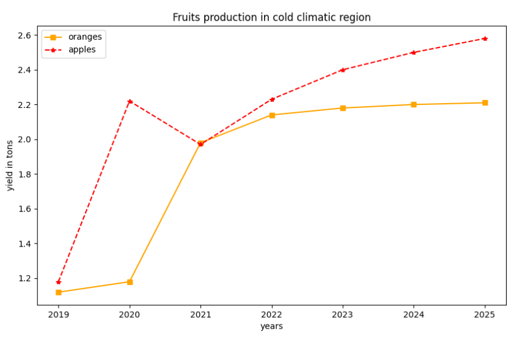
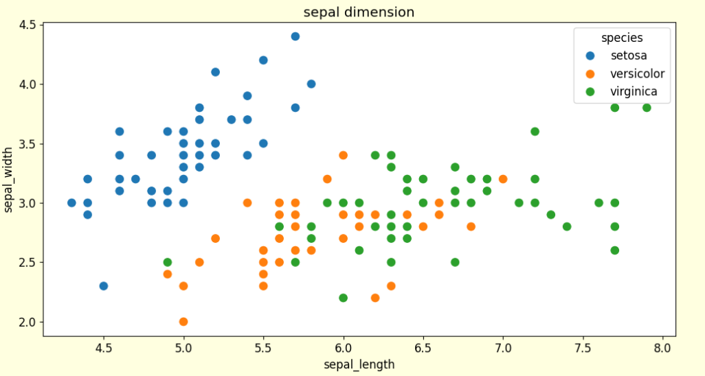
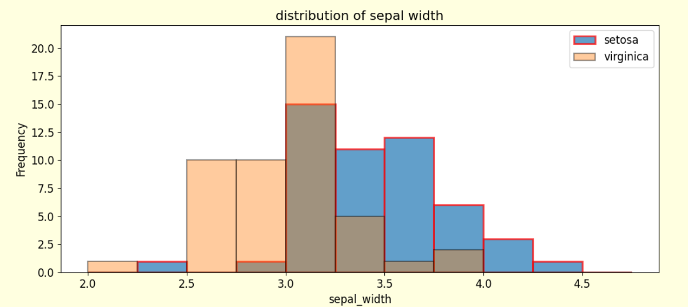
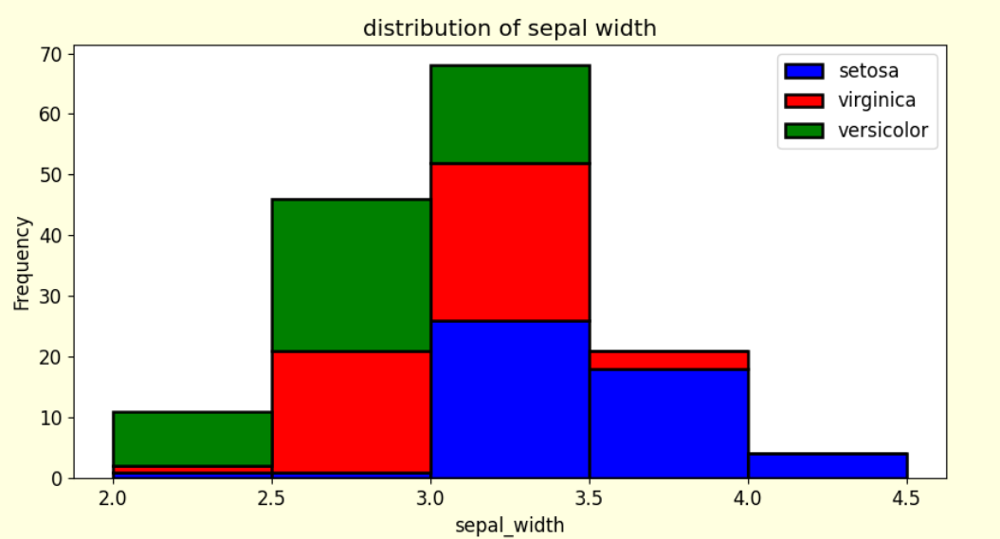
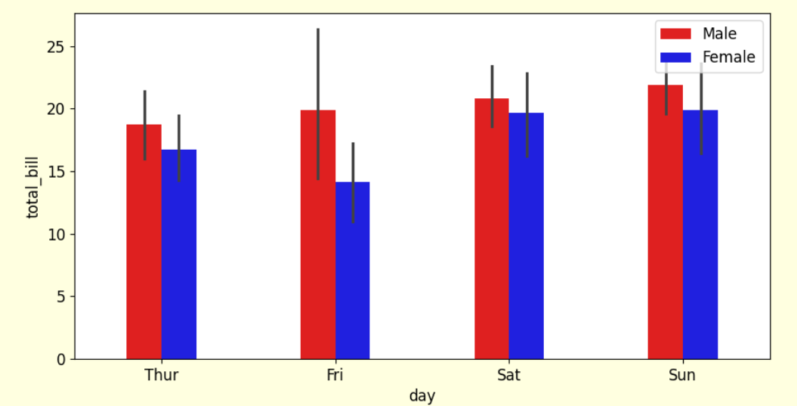
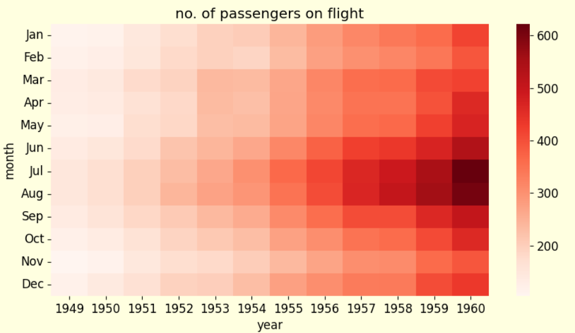
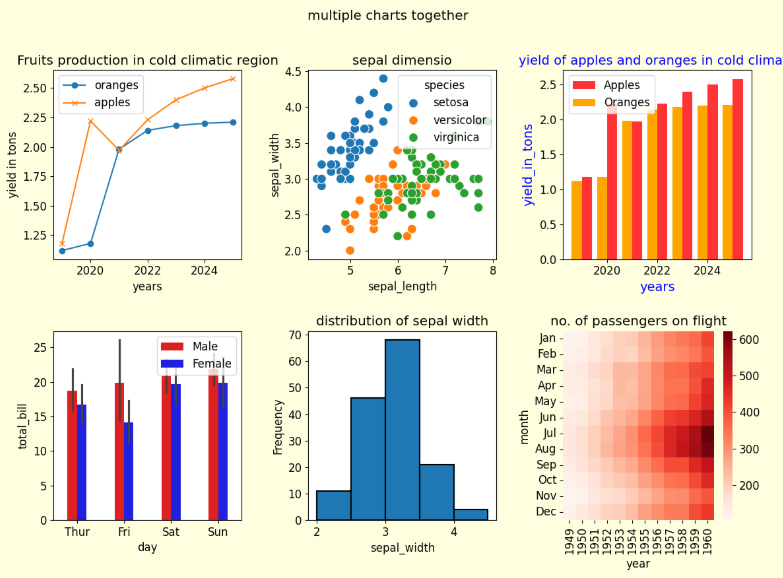

# Python Data Visualization using Matplotlib & Seaborn

## Introduction
This repository showcases my hands-on practice and learning journey with Python data visualization using Matplotlib and Seaborn. The code demonstrates the implementation of a variety of visualization techniques, including line charts, bar charts, stacked bar charts, grouped (clustered) bar charts, histograms, scatter plots, heatmaps, and multiple plots on a single canvas.
Through this project, I explored different plotting functions, formatting options, colors, legends, annotations, layouts, and styling techniques.

## Technologies Used
- Python
- Matplotlib
- Seaborn
- NumPy
- Pandas

## Python Code
```python
import matplotlib.pyplot as plt
import matplotlib
import seaborn as sns
import numpy as np
# creating a simple line chart
#===========================================================================
orange_yield=[1.12,1.18,1.98,2.14,2.18,2.20,2.21]
years=[2019,2020,2021,2022,2023,2024,2025]
plt.plot(years,orange_yield)
plt.xlabel("years")
plt.ylabel("yield of oranges in tons")
plt.savefig("yield_of_oranges_over_years")
#===========================================================================
# creating two trends/line chart in one to compare their trends over years
orange_yield=[1.12,1.18,1.98,2.14,2.18,2.20,2.21]
years=[2019,2020,2021,2022,2023,2024,2025]
apple_yield=[1.18,2.22,1.97,2.23,2.4,2.5,2.58]
plt.plot(years,orange_yield,label="oranges",marker="o")
plt.plot(years,apple_yield,label="apples",marker="x")
plt.xlabel("years")
plt.ylabel("yield in tons")
plt.legend()
plt.title("Fruits production in cold climatic region")
plt.savefig("V1_yield_of_oranges_vs_apples_over_years")
#===================================================================
""" for for chart formatting/styling we can do following things.
    for colour-use c="b" or c="r", for linestyle-use ls="-" or ls="--" 
    , for linewidth-use like lw=6, for marker size- uselike ms=3,
      for markeredge colour- use like mec="b",for markeredge width-mew
      for opacity of graph-use like alpha=0.6 (for 60% of opacity)"""
plt.figure()
plt.plot(years,orange_yield,label="oranges",marker="o",c="orange",ls="--",
            lw=4,ms=4,mfc="black",alpha=0.9,mew=1.5,mec="black")
plt.plot(years,apple_yield,label="apples",marker="x",lw=4,c="red",mec="black",
              ms=8,mfc="black",alpha=0.75,mew=1.5)
plt.xlabel("years")
plt.ylabel("yield in tons")
plt.legend()
plt.title("Fruits production in cold climatic region")
plt.savefig("V2_yield_of_oranges_vs_apples_over_years")
```
### Output

```python
#=============================================================================
# for quick formatting use fmt-like "markertypelinestylelinecolour"
plt.figure(figsize=(10,6)) # we can change canvas size by figsize
plt.plot(years,orange_yield,"s-",c="orange",label="oranges")
plt.plot(years,apple_yield,"*--r",label="apples")
plt.xlabel("years")
plt.ylabel("yield in tons")
plt.legend()
plt.title("Fruits production in cold climatic region")
plt.savefig("V3_yield_of_oranges_vs_apples_over_years")
#===========================================================================
plt.figure(figsize=(10,5)) # we can change canvas size by figsize
plt.bar(years,orange_yield,color="orange",width=0.35,label="oranges")
plt.plot(years,apple_yield,"*--r",label="apples")
plt.xlabel("years")
plt.ylabel("yield in tons")
plt.legend()
plt.title("Fruits production in cold climatic region")
plt.savefig("V4_yield_of_oranges_vs_apples_over_years")
#===================================================================
# using seaborn we can change asthetic of chart easily
matplotlib.rcParams["font.size"]=14
#matplotlib.rcParams["figure.figsize"]=(10,5)
matplotlib.rcParams["figure.facecolor"]="lightyellow"
#sns.set_style("darkgrid")
plt.figure(figsize=(10,5))
plt.plot(years,orange_yield,"s-",c="orange",label="oranges")
plt.plot(years,apple_yield,"*--r",label="apples")
plt.xlabel("years")
plt.ylabel("yield in tons")
plt.legend()
plt.title("Fruits production in cold climatic region")
plt.savefig("V5_yield_of_oranges_vs_apples_over_years")
#=======================================================================
# using matplotlib.rcparams -set things which applied on every chart aterward
matplotlib.rcParams["font.size"]=12
matplotlib.rcParams["figure.figsize"]=(10,5)
matplotlib.rcParams["figure.facecolor"]="lightyellow"
#============================================================
# load panda data frame by using pd.read_csv() or use sns dataset
plt.figure(figsize=(14,7))
flower_df=sns.load_dataset("iris")
print(flower_df["species"].unique())# to check distinct values ofa column
"""now let's draw a line chart and scatterplot to show how scatter plot is
    useful to depict relationship between two variable"""
print(flower_df[1:2])
plt.plot(flower_df["sepal_length"],flower_df["sepal_width"])
plt.savefig("line_chart_rel_sep_len_and_sep_wid")
plt.figure()
sns.scatterplot(x=flower_df["sepal_length"],y=flower_df["sepal_width"],
                hue=flower_df["species"],s=100)
plt.title("sepal dimensio")
plt.savefig("scatterplot_rel_sep_len_and_sep_wid")
#============================================================================
""" seaborn greatly support pandas, so we give directly column names and 
          mention pandas data frame using data argument"""

plt.figure(figsize=(12,6))
sns.scatterplot(x="sepal_length",y="sepal_width",hue="species",s=100,
                                              data=flower_df)
plt.title("sepal dimension")
plt.savefig("V2_scatterplot_rel_sep_len_and_sep_wid")
```
### Output

```python
#==========================================================================
# building and customizing histogram
print(flower_df.describe()) # this gives statistical analysis of each column
plt.figure(figsize=(10,5))
import numpy as np
print(np.arange(2,5,0.5))
plt.hist(flower_df.sepal_width,bins=np.arange(2,5,0.5),edgecolor="black",
                         linewidth=1.5)
# edgecolor- lines of bar will black, linewidth- thickness of line of bar 
plt.title("distribution of sepal width")
plt.xlabel("sepal_width")
plt.ylabel("Frequency")
plt.savefig("histogram_sepal_with")
#==========================================================================
# creating two histogram side by side
plt.figure(figsize=(12,5))
plt.hist(flower_df[flower_df["species"]=="setosa"]["sepal_width"],
         bins=np.arange(2,5,0.25),label="setosa",
         edgecolor="red",linewidth=2,alpha=0.7)
plt.hist(flower_df[flower_df["species"]=="virginica"]["sepal_width"],
         bins=np.arange(2,5,0.25),label="virginica",
         edgecolor="black",linewidth=1.5,alpha=0.4)
plt.xlabel("sepal_width")
plt.ylabel("Frequency")
plt.legend()
plt.title("distribution of sepal width")
plt.savefig("2-histogram_sepal_width")
```
### Output

```python
#=====================================================================
plt.figure(figsize=(10,5))
plt.hist([flower_df[flower_df["species"]=="setosa"]["sepal_width"],
         flower_df[flower_df["species"]=="virginica"]["sepal_width"],
        flower_df[flower_df["species"]=="versicolor"]["sepal_width"] ],
         bins=np.arange(2,5,0.5),
         label=["setosa","virginica","versicolor"],
         color=["blue","red","green"],
         edgecolor="black",linewidth=1.8,stacked=True)         
plt.xlabel("sepal_width")
plt.ylabel("Frequency")
plt.legend()
plt.title("distribution of sepal width")
plt.savefig("stacked-histogram_sepal_width")
```
### Output

```python
#=========================================================================
# creating bar chart and line chart together
plt.figure(figsize=(10,5))
plt.bar(years,apple_yield,color="red",width=0.4,edgecolor="black",
           alpha=0.8)
plt.xlabel("years",color="blue")
plt.ylabel("yield_of_apples_in_tons",color="blue")
plt.title("yield of apples in cold climate",color="blue")
plt.plot(years,apple_yield,marker="o",c="blue",lw=1.8,ls="--",
                             ms="10",mec="black",mfc="yellow" )
plt.savefig("bar_chart_apple_yield")
#=========================================================================
# creating two bar chart side by side(clustered bar chart)
plt.figure(figsize=(10,5))
years=np.array(years)
plt.bar(years+0.2,apple_yield,label="Apples",color="red",width=0.4,
                                    alpha=0.8)
plt.bar(years-0.2,orange_yield,label="Oranges",color="orange",width=0.4)
plt.xlabel("years",color="blue",fontsize=14)
plt.ylabel("yield_in_tons",color="blue",fontsize=14)
plt.legend()
plt.title("yield of apples and oranges in cold climate",color="blue",fontsize=14)
plt.savefig("2_bar_chart_apple_orange_yield")
#=========================================================================
# creating stacked bar chart
plt.figure(figsize=(10,5))
plt.bar(years,apple_yield,label="Apples",color="red",width=0.4,alpha=0.8)
plt.bar(years,orange_yield,label="Oranges",color="orange",width=0.4,
        bottom=apple_yield)
plt.xlabel("years",color="blue",fontsize=14)
plt.ylabel("yield_in_tons",color="blue",fontsize=14)
plt.legend()
plt.title("yield of apples and oranges in cold climate",color="blue",
                        fontsize=14)
plt.savefig("stacked_bar_chart_apple_orange_yield")
#========================================================================
# creating bar chart to depict averages value
tips_df=sns.load_dataset("tips")
print(tips_df[1:2])
total_bill_daywise=tips_df.groupby("day",observed=True)
avg_total_bill_daywise=total_bill_daywise["total_bill"].mean()
print(avg_total_bill_daywise)
plt.figure()
plt.bar(avg_total_bill_daywise.index,avg_total_bill_daywise,
            color="red",width=0.4)
plt.savefig("avg_total_bill")
#====================================================================
# creating the above bar chart using seaborn
plt.figure()
# hue is used to create a comparison type of scenario
sns.barplot(x="day",y="total_bill",hue="sex",data=tips_df,width=0.4,
            palette=["red","blue"])
plt.legend(loc="upper right") # control position of legend
plt.savefig("sns_avg_total_bill")
```
### Output

```python
# sns.barplot, by default calculate mean,but we can change the statistics
# to sum,max,min,median by using estimator=
#========================================================================
# creating heatmap
flights_df=sns.load_dataset("flights")
print(flights_df[1:2])
# for creating heatmap, we have transform the dataframe by .pivot() method
flights_t_df=flights_df.pivot(index="month",columns="year",values="passengers")
plt.figure()
sns.heatmap(flights_t_df,annot=False,fmt="d",cmap="Reds")
plt.title("no. of passengers on flight")
plt.savefig("heatmap_flights_df")
```
### Output

```python
# Note:- annot=true will show value in cell in heatmap,
# fmt:- control display whether integer or decimal, cmap=color map"""
#=====================================================================
# working with image file
plt.figure()
import urllib.request
urllib.request.urlretrieve(r"https://raw.githubusercontent.com/suryaprakash1222/Italy-COVID-19-Data-Analysis-using-Pandas/refs/heads/main/Visual2.png","Image_stacked_bar.png")
import PIL.Image
img=PIL.Image.open("Image_stacked_bar.png")
img_array=np.array(img)
print(img_array.shape)
plt.imshow(img)
#=====================================================================
# plotting multiple charts on one layout using plt.subplot()
fig,axes=plt.subplots(2,3,figsize=(12,9))
axes[0,0].plot(years,orange_yield,label="oranges",marker="o")
axes[0,0].plot(years,apple_yield,label="apples",marker="x")
axes[0,0].set_xlabel("years")
axes[0,0].set_ylabel("yield in tons")
axes[0,0].legend()
axes[0,0].set_title("Fruits production in cold climatic region")

sns.scatterplot(x=flower_df["sepal_length"],y=flower_df["sepal_width"],
                hue=flower_df["species"],s=100,ax=axes[0,1])
axes[0,1].set_title("sepal dimensio")

axes[0,2].bar(years+0.2,apple_yield,label="Apples",color="red",width=0.4,
                                    alpha=0.8)
axes[0,2].bar(years-0.2,orange_yield,label="Oranges",color="orange",width=0.4)
axes[0,2].set_xlabel("years",color="blue",fontsize=14)
axes[0,2].set_ylabel("yield_in_tons",color="blue",fontsize=14)
axes[0,2].legend()
axes[0,2].set_title("yield of apples and oranges in cold climate",color="blue",fontsize=14)

sns.barplot(x="day",y="total_bill",hue="sex",data=tips_df,width=0.4,
            palette=["red","blue"],ax=axes[1,0])
axes[1,0].legend(loc="upper right") # control position of legend

axes[1,1].hist(flower_df.sepal_width,bins=np.arange(2,5,0.5),edgecolor="black",
                         linewidth=1.5)
# edgecolor- lines of bar will black, linewidth- thickness of line of bar 
axes[1,1].set_title("distribution of sepal width")
axes[1,1].set_xlabel("sepal_width")
axes[1,1].set_ylabel("Frequency")

sns.heatmap(flights_t_df,annot=False,fmt="d",cmap="Reds",ax=axes[1,2])
axes[1,2].set_title("no. of passengers on flight")
fig.suptitle("multiple charts together")
plt.tight_layout(pad=2)
fig.savefig("multiple charts together.png")
```
### Output

#=========================================================================
## Conclusion
This project represents my practical learning and hands-on experience with Python data visualization using Matplotlib and Seaborn. It demonstrates my understanding of creating, customizing, and presenting different types of charts for effective data analysis. I will continue expanding this repository by exploring more visualization techniques and real-world datasets.

## Author
**Surya Prakash**
Data Analyst | Python | Data Visualization
